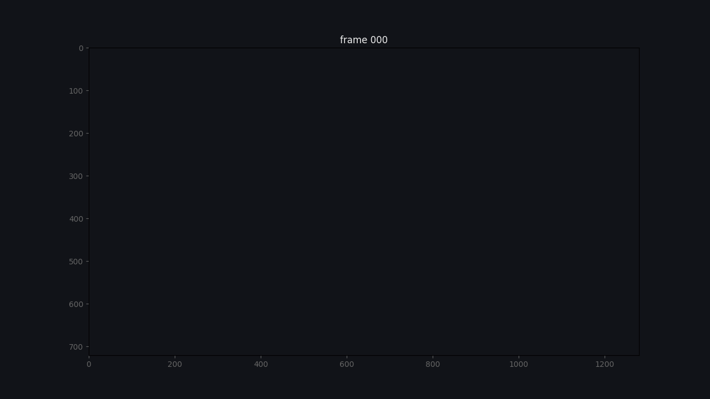
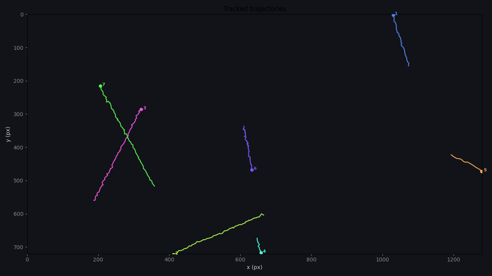
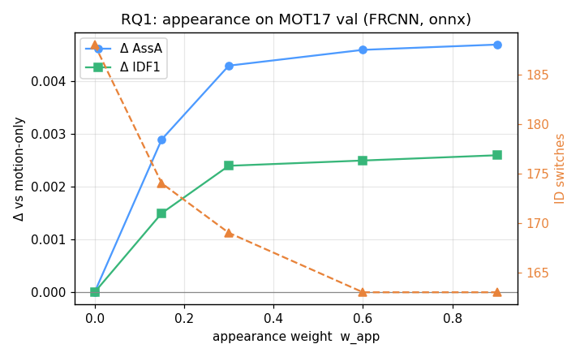
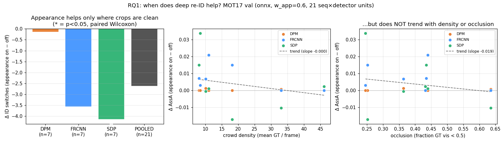
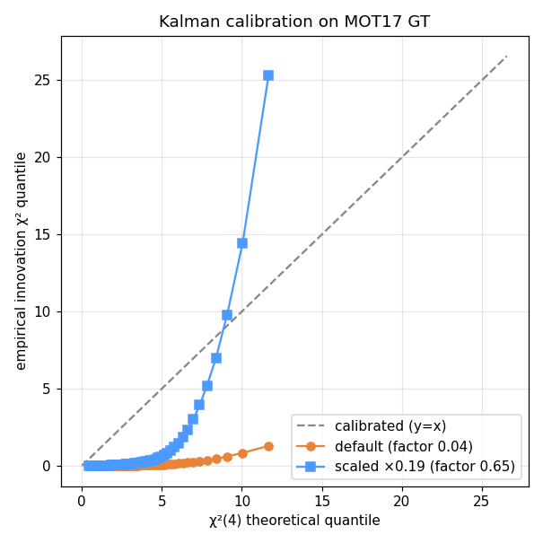

# VisionTrack

[](https://github.com/hulagerushikesh/visiontrack/actions/workflows/ci.yml)
[](https://www.python.org/)
[](LICENSE)
[](https://visiontrack.hulage.in)
[](https://colab.research.google.com/github/hulagerushikesh/visiontrack/blob/main/notebooks/reproduce.ipynb)

**A from-scratch multi-object tracker, used as a controlled study of *when* the field's standard tricks actually help.**

The tracker — an 8-state **Kalman filter**, an O(n³) **Hungarian** solver, and **ByteTrack** two-stage association — is implemented from first principles on NumPy, with no ML framework in the core. On top of it sits a reproducible experiment harness that measures, on **real MOT17** with seed variance and paired significance tests, whether **appearance** and **uncertainty-aware association** actually improve tracking. Several of the answers are honest negatives — which is the point.



*The tracker on a synthetic scene — boxes in, stable per-object IDs out. A **real-MOT17** version can be rendered locally on your own copy of the dataset with `python scripts/render_mot17_demo.py` (the frames aren't redistributed here — MOT17 is under a non-commercial share-alike licence).*

---

## Abstract

Most tracking repositories are a thin wrapper over a detector plus a vendored tracker; every reported number is a single run on one configuration. VisionTrack inverts that: the estimation and association math *is* the deliverable (independently tested against SciPy and `trackeval`), and it is used to run a **falsifiable study**. We reproduce a from-scratch ByteTrack baseline on MOT17 public detections (HOTA/IDF1 verified against `trackeval` to within `1.4e-3`), then ablate two common enhancements under seed variance and Wilcoxon significance:

- **Appearance (RQ1)** — a per-track re-ID cost helps *association* on MOT17 (ID switches 188 → 170) but the effect is small and not significant with a cheap descriptor.
- **Uncertainty (RQ3)** — folding calibrated Kalman uncertainty into the cost is **null**, and *calibrating* the filter to real motion is **actively harmful** under detector noise (ID switches 40 → 400+). The filter's apparent under-confidence turns out to be a robustness feature, not a bug.



*Synthetic sanity check: seven objects over 120 frames — tracks **#3** and **#7** cross in the centre and keep their identities.*

---

## Research questions

| | Question | Answer on MOT17 |
|---|---|---|
| **RQ1** | Does an appearance (re-ID) association cost improve tracking? | Yes — deep re-ID **significantly** cuts ID switches on **both MOT17 and DanceTrack** (p<0.05). The predicted "appearance hurts on near-identical dancers" **sign-flip does not occur**: a gated cost that only *ranks* within the motion gate is robustly beneficial-or-neutral |
| **RQ2** | Does a learned motion residual on top of constant-velocity help? | **It helps *prediction* only where motion is non-linear** (DanceTrack next-centre error −12.5%; MOT17 +21.5% worse, since CV is already ~1px there) — but that gain **hurts *tracking*** on both (train-on-GT/infer-on-noisy skew + it perturbs the association gate). A from-scratch NumPy MLP |
| **RQ3** | Does folding *calibrated* Kalman uncertainty into the cost reduce switches under noise? | **No** — null as a soft cost; calibrating the filter *hurts* badly under detector noise |

The value is the same whichever way each result falls: a controlled study that shows a trick *doesn't* help is a contribution, not a failure.

---

## Method

**The from-scratch core** (`core/`, NumPy only):

- **Kalman filter** — 8-state constant-velocity model in DeepSORT's `xyah` parametrization, height-scaled noise for scale-invariance, Joseph-form covariance update, Mahalanobis gating. Convergence-tested.
- **Hungarian assignment** — rectangular O(n³) Kuhn–Munkres with dual potentials; validated against `scipy.optimize.linear_sum_assignment` on 150 random matrices.
- **ByteTrack two-stage association** + a `Tentative → Confirmed → Deleted` lifecycle FSM.

**The ablation surface** (`tracking/cost.py`): the association cost is factored so each hypothesis is one weighted term with a hard gate deciding feasibility and the terms only *ranking* feasible pairs (DeepSORT-style fusion):

```
cost = w_iou·motion  ⊕  w_app·appearance  ⊕  w_unc·uncertainty      (gate: IoU + class + Mahalanobis)
```

At `w_app = w_unc = 0` this is **bit-identical** to the plain `1 − IoU` baseline, so every ablation toggles exactly one variable.

**Rigor** (`eval/`, `experiments/`):

- **Metrics**: from-scratch **CLEAR-MOT + IDF1 + HOTA**, cross-checked against `trackeval` end-to-end on real MOT17 (MOTA/IDF1 exact, HOTA within `1.4e-3`).
- **Seed variance + paired significance**: every configuration is run over seeds; variants are compared paired (same sequences/seeds) with a **paired bootstrap + Wilcoxon** test and Cohen's d.
- **Compute once**: detections and appearance embeddings are cached to disk (5.2 MB detections; 6.3 MB colour-histogram or 67 MB deep-re-ID features for all of MOT17-train), so the raw ~5 GB of frames can be deleted and every experiment runs CPU-only in seconds.

---

## Results

### Baseline — from-scratch ByteTrack on real MOT17 (val-half, public detections)

| detector | MOTA | IDF1 | HOTA | DetA | AssA |
|----------|-----:|-----:|-----:|-----:|-----:|
| **SDP**   | 0.624 | 0.673 | 0.565 | 0.542 | 0.589 |
| **FRCNN** | 0.469 | 0.570 | 0.497 | 0.423 | 0.587 |
| **DPM**   | 0.115 | 0.182 | 0.193 | 0.093 | 0.404 |

Squarely in the public-detection neighbourhood (the famous ~76 MOTA ByteTrack uses a private YOLOX detector), with the expected detector ordering. `scripts/xcheck_mot17_trackeval.py` confirms our whole pipeline (preprocessing + metrics) matches `trackeval` on a real sequence.

### RQ1 — appearance (MOT17 FRCNN), from-scratch histogram vs deep re-ID

Δ vs the `w_app=0` motion-only baseline (HOTA 0.497 / IDF1 0.570 / AssA 0.587 / IDSW 188), same 7-sequence pairing:

| w_app=0.6 embedder | HOTA | IDF1 | AssA | IDSW |
|--------------------|------|------|------|-----:|
| from-scratch colour histogram | +0.001 | +0.002 | +0.003 | 170 (−18) |
| **deep re-ID** (OSNet-x0.25, MSMT17, ONNX) | **+0.004** | **+0.004** | **+0.008** | **163 (−25)** |



Appearance's clearest effect is on **ID switches**. A deep re-ID embedder — a pretrained OSNet run through `appearance/reid_onnx.py` behind the same interface — **roughly doubles** the association gain over the hand-crafted histogram and cuts ID switches to **163 (−13%)**, earning that weight *early* (−14 IDSW already at `w_app=0.15`).

Pooling all **three public detectors** (DPM/FRCNN/SDP → 21 seq×detector units) for statistical power, the **ID-switch and IDF1 reductions become significant** (paired Wilcoxon p<0.05); association-quality (AssA/HOTA) stays marginal (p≈0.06). The instructive twist: appearance is **completely inert on the weak DPM detector** — its poorly-localized boxes yield mis-framed crops, so the re-ID embeddings carry no identity signal. **Detection/crop quality gates whether appearance helps at all**, the opposite of the "weak detector needs it most" intuition, and it doesn't stratify by crowd density or occlusion. [Details →](docs/PHASE3.md)



### RQ2 — learned motion residual (helps prediction, hurts tracking)

A from-scratch NumPy MLP (hand-written back-prop + Adam — no framework) predicts a correction to the constant-velocity Kalman mean, trained on GT trajectories.

| | CV next-centre error | + residual |
|---|---|---|
| MOT17 (near-linear) | 1.05 px | **1.27 (−21% worse)** |
| DanceTrack (non-linear) | 6.89 px | **6.03 (+12% better)** |

Open-loop, the residual helps *exactly* where motion is non-linear — but wired into the tracker it **hurts identity on both** (DanceTrack HOTA −0.043, +29 IDSW; MOT17 HOTA −0.013, +12 IDSW). Trained on clean GT but fed the tracker's noisy estimates, its correction mis-fires and perturbs the association gate. A better predictor that makes a worse tracker. [Details →](docs/PHASE4.md)

### RQ3 — calibrated uncertainty (the interesting negative)

Stepping the Kalman filter along real MOT17 GT, the innovation χ² is **0.15** where a calibrated filter would give **4.0** — it is ~25× *under-confident*, so its 95% gate captures **100%** of innovations and never rejects.



Consequences, measured:

- Folding uncertainty into the cost (`w_unc`) is **null** (the gate is inert, the signal near-constant).
- *Calibrating* the filter (`kf_noise_scale=0.19`) is **catastrophic under detector noise**: HOTA −0.205, **ID switches 40 → 400+** (both p<0.05). A tight gate tuned to clean motion rejects noisy-but-correct detections and tracks fragment.

**The loose gate is a robustness feature, not a bug.** This unifies with the ablation finding that disabling the gate barely changes clean-data results. [Details →](docs/PHASE5.md)

### Throughput

Real-time on CPU (single-threaded): **2841 FPS** at 4 objects down to **294 FPS** at 64 — comfortably ≥30 FPS across the range (`benchmarks/bench_tracker.py`). The per-frame Kalman predict and Mahalanobis gating are batched across the whole track set (~1.4–1.5× over the per-track loop, numerically identical).

---

## Install & use

```bash
pip install visiontrack-mot            # core: NumPy only
pip install 'visiontrack-mot[video]'   # + run on your own video files
```

```python
from visiontrack import ByteTracker, TrackerConfig
tracker = ByteTracker(TrackerConfig())
for frame_detections in stream:            # list[Detection]
    observations = tracker.update(frame_detections)
```

Track a real video from the command line (needs a YOLOX ONNX model, see [docs/VIDEO.md](docs/VIDEO.md)):

```bash
visiontrack track input.mp4 out.mp4 --model models/yolox_nano.onnx
```

Full public API: [docs/API.md](docs/API.md) · packaging/release: [docs/RELEASE.md](docs/RELEASE.md).

**Benchmark a set of trackers** into one report (leaderboard + paired significance + ID-switch error taxonomy) — `make benchmark`, or see the live report at **[visiontrack.hulage.in/benchmark](https://visiontrack.hulage.in/benchmark)**.

## Reproduce

**No install? Run the synthetic study in your browser:**
[](https://colab.research.google.com/github/hulagerushikesh/visiontrack/blob/main/notebooks/reproduce.ipynb)
— clones, installs the harness extra, and reproduces the seed-varied, significance-tested synthetic tables (a couple of minutes, CPU-only). Notebook: [`notebooks/reproduce.ipynb`](notebooks/reproduce.ipynb).

```bash
make install                 # editable install with all extras
make test                    # full test suite
make reproduce-synth         # synthetic harness + RQ3 probe — NO dataset needed
```

Full real-data reproduction (after a one-time cache build — see [docs/PHASE0.md](docs/PHASE0.md)):

```bash
python data/cache/precompute.py            --data-root ~/MOT17 --detector FRCNN --out data/cache/mot17
python data/cache/precompute_embeddings.py --data-root ~/MOT17 --detector FRCNN --cache-dir data/cache/mot17
make reproduce               # regenerates every table and figure above
```

Every run is pinned by a config hash; bootstrap resampling and synthetic scenes are seeded. Each phase has a runbook in [`docs/`](docs/) (`PHASE0.md` … `PHASE5.md`).

---

## Engineering

- **Zero ML-framework dependency in the core** — just NumPy. Heavy/optional deps (`scipy`, `pandas`, `matplotlib`, `pillow`, `onnxruntime`, `torch`) are isolated in extras (`[experiments]`, `[appearance]`, `[onnx]`) and lazily imported; nothing in `core/` imports them.
- **253 tests**: unit, property (Hungarian vs SciPy), convergence (Kalman), metric cross-checks (HOTA/IDF1 vs `trackeval`), and end-to-end integration with a MOTA floor.
- **CI** on Python 3.10/3.11/3.12 + ruff.

```
src/visiontrack/
  core/        geometry · kalman · assignment          ← from-scratch math
  detection/   base · synthetic · onnx_yolo · mot_loader · noise
  appearance/  embedder (colour-hist) · reid_onnx · gallery   (RQ1)
  tracking/    tracker · track (FSM) · cost (ablation surface) · config
  eval/        mot (CLEAR-MOT) · hota (HOTA/IDF1) · stats · calibration (RQ3)
  datasets/    splits (frozen) · cache (detections + embeddings)
experiments/   run_matrix · analyze · appearance_study · uncertainty_study · configs/
data/cache/    precompute · precompute_embeddings
scripts/       xcheck_mot17_trackeval.py
```

---

## Limitations & honest negatives

- **Public-detection, train/val split** — reproducible and self-contained, not test-server leaderboard numbers (deliberate).
- **RQ1's effect is real but small on MOT17** — a deep re-ID embedder (OSNet-x0.25, MSMT17) roughly doubles the association gain over the from-scratch histogram; pooling all three detectors (21 units) makes the **ID-switch/IDF1 reduction significant**, but association quality (AssA/HOTA) stays marginal and the benefit is capped by public-detection crop quality. A controlled **synthetic probe** (dialing inter-object appearance similarity) confirms the benefit *grows with object distinctness* and is significant on AssA/IDF1 — but never flips to *harmful*. And the decisive test — real **DanceTrack** (near-identical dancers, non-linear motion, the predicted "appearance hurts" case) — **refutes the hypothesis**: deep re-ID *still* significantly cuts ID switches there (217→202, p<0.05). Across all three probes a gated appearance cost is robustly beneficial-or-neutral. The "appearance hurts on DanceTrack" failure is a property of *appearance-vetoing* designs, not of uniform appearance itself — our cost only lets appearance **rank within the motion gate, never veto** a feasible match. Re-ID weights carry a non-commercial dataset licence and are **not committed** (regenerate from your own download).
- **RQ2 (learned motion residual) is answered — an honest negative.** A from-scratch NumPy MLP (hand-written back-prop, no framework) lowers open-loop next-centre error on DanceTrack (−12.5%) but not MOT17 (near-linear, ~1px CV error → +21.5% worse); crucially, inside the tracker it **hurts** on both (train-on-GT / infer-on-noisy-estimates distribution shift + it perturbs the association gate). Trained on GT trajectories; weights gitignored. [Details → docs/PHASE4.md](docs/PHASE4.md)
- **The cross-dataset RQ1 test is done on DanceTrack, with a scope caveat** — detections are oracle-perturbed GT (DanceTrack ships none), which gives clean crops that *favour* appearance; a poor real detector would weaken it (cf. DPM). The cost is weighted-and-gated, not pure-appearance. So the refutation is scoped: *a gated ranking appearance cost does not hurt, even on DanceTrack.* SportsMOT (RQ2 maneuver data) is still deferred.
## Interactive demo

A self-contained, pre-baked demo that makes the RQ1 result tangible: the same
synthetic scene tracked two ways — motion-only vs motion + appearance — with the
running ID-switch count side by side. Boxes are coloured by track ID, so a colour
flip on a moving object *is* a switch.

- **Try it live:** **[visiontrack.hulage.in/demo](https://visiontrack.hulage.in/demo)** — no install, runs in the browser (deployed from `viz/webdemo/` via Vercel; project home at [visiontrack.hulage.in](https://visiontrack.hulage.in)).
- **Build it locally:** `make demo` → open [`viz/webdemo/index.html`](viz/webdemo/index.html) in any browser (no server, no dataset, no toolchain — inference is pre-baked from the NumPy tracker on a synthetic scene).
- On the selected scene, appearance cuts ID switches **37 → 29 (−22%)** and lifts IDF1 — the study result, watchable frame by frame.

## Write-up

A narrative walk-through of the study — why appearance *refuses* to hurt (even on
DanceTrack), how a better motion predictor made a *worse* tracker, and why the
filter's loose gate is a feature: **[visiontrack.hulage.in/writeup](https://visiontrack.hulage.in/writeup)**.
The honest negatives, explained in plain prose rather than tables.

## Study guide

New to the concepts? Two self-paced, interactive learning files (single self-contained
HTML, progress checkboxes saved in your browser — open in any browser):

- [`docs/LEARNING_PATH.html`](docs/LEARNING_PATH.html) — **this project, topic by topic**:
  Kalman → Hungarian → ByteTrack → metrics → the three research questions → where to take
  it next, with every concept linked to the file it lives in.
- [`docs/CV_ROADMAP.html`](docs/CV_ROADMAP.html) — **the whole field, in order**: a
  junior → mid → senior → research computer-vision roadmap (foundations → deep learning →
  detection/segmentation/tracking → transformers/generative/3D → production → doing research),
  with what-to-build and canonical resources at each stage.

## License

MIT
