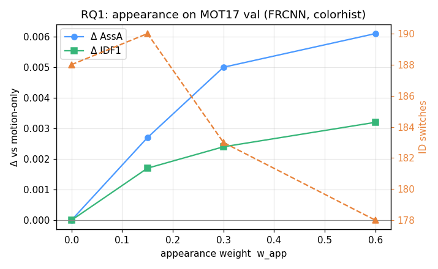
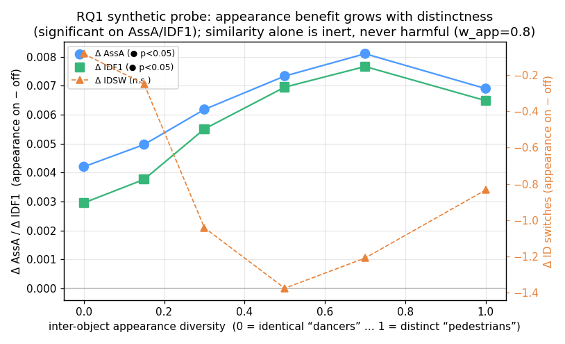

# Phase 3 — RQ1: appearance association (the centerpiece)

Question (RQ1): *does an appearance (re-ID) association cost improve tracking,
and where does it start to hurt?* This phase builds the appearance branch and
answers the **MOT17 half** of RQ1. The cross-dataset crossover (DanceTrack,
where appearance is expected to *hurt*) is deferred — the 256 GB / MOT17-only
storage constraint means DanceTrack/SportsMOT don't fit yet.

## What shipped

| Piece | Where | Role |
|-------|-------|------|
| Embedders | [`appearance/embedder.py`](../src/visiontrack/appearance/embedder.py) | `ColorHistogramEmbedder` (from-scratch HSV histogram, **no download**), `IdentityEmbedder` (tests) |
| Deep re-ID (wired) | [`appearance/reid_onnx.py`](../src/visiontrack/appearance/reid_onnx.py) | `OnnxReID` — pretrained OSNet/FastReID ONNX behind the same interface (lazy); batch-padded, ImageNet-normalized. **Run and reported below** — the strongest RQ1 result |
| EMA gallery | [`appearance/gallery.py`](../src/visiontrack/appearance/gallery.py) | per-track appearance memory (`update_gallery`) |
| Track wiring | [`tracking/track.py`](../src/visiontrack/tracking/track.py) | tracks carry an EMA `feature`, updated from matched detections |
| Cost hook | already in place (Phase 2) | `w_app` term in `build_association_cost` |
| Embedding cache | [`data/cache/precompute_embeddings.py`](../data/cache/precompute_embeddings.py) + `datasets/cache.py` | embed each detection once → `.emb.npz` aligned to the detection cache |
| Study | [`experiments/appearance_study.py`](../experiments/appearance_study.py) | appearance-on/off sweep with paired significance + figure |

Design: the embedder is **pluggable** (color histogram now, deep re-ID later),
appearance is a **weighted cost term** (`w_app`), and embeddings are **cached
once** so the sweep is CPU-only and fast. Core is untouched.

## Run it

```bash
pip install -e ".[experiments,appearance]"
# 1. detections (Phase 0) then embeddings (once, reads img1 crops):
python data/cache/precompute.py            --data-root ~/Downloads/MOT17 --detector FRCNN --out data/cache/mot17
python data/cache/precompute_embeddings.py --data-root ~/Downloads/MOT17 --detector FRCNN --cache-dir data/cache/mot17
# 2. the study:
python -m experiments.appearance_study --detector FRCNN --out-fig assets/appearance_mot17_frcnn.png
```

Detection cache: 5.2 MB. Embedding cache (32-dim color histogram, 7 seqs):
6.3 MB. Both tiny; raw frames stay deletable.

## Result (MOT17 val-half, FRCNN public detections, color-histogram embedder)

Δ vs the `w_app=0` motion-only baseline; `*` = p<0.05 (Wilcoxon over 7 sequences).

| w_app | HOTA | IDF1 | AssA | MOTA | IDSW |
|------:|------|------|------|------|-----:|
| 0.00  | 0.497 | 0.570 | 0.587 | 0.469 | 188 |
| 0.15  | +0.001 | +0.000 | +0.001 | −0.000 | 186 |
| 0.30  | +0.001 | +0.001 | +0.002 | −0.000 | 182 |
| 0.60  | +0.001 | +0.002 | +0.003 | +0.001 | **170 (−18)** |



> **Numbers updated after the Phase 5 cost fix.** Phase 5 found that the
> original cost let a soft term *veto* feasible pairs (shrinking the gate); the
> corrected cost uses the terms purely to **rank** in-gate pairs (see
> `docs/PHASE5.md`). These are the corrected, ranking-cost numbers.

### Reading it honestly

- **Appearance's clearest effect is on ID switches: 188 → 170 (−10%)** as
  `w_app` increases — exactly what appearance is for (holding identity through
  ambiguity). The gain shows up in AssA/IDF1 too, but tiny (+0.002–0.003).
- **HOTA barely moves (+0.001)** and **MOTA is flat** — expected: appearance
  touches only *association*, not detection, and an HSV colour histogram is a
  *weak* descriptor.
- **Not statistically significant** at p<0.05 over 7 sequences — directionally
  consistent, small in magnitude. The honest read: a cheap appearance cue nudges
  identity stability on MOT17 but won't move HOTA much. The obvious next lever is
  a deep re-ID embedder (`OnnxReID`), which drops in behind the same interface
  and should widen the gap.

This supports the RQ1 hypothesis on MOT17 (diverse pedestrian appearance ⇒
appearance helps). The predicted **sign flip on DanceTrack** (near-identical
dancers ⇒ appearance hurts) is the deferred cross-dataset half.

## Tests

`tests/test_appearance.py` (9) covers the EMA gallery, both embedders, and the
key proof that the appearance term **breaks an otherwise-symmetric motion tie**
toward the appearance-consistent assignment. `tests/test_mot_loader.py` adds
embedding-cache alignment (and misalignment → error). Behavior is unchanged
when `w_app=0`: all prior tracker/eval tests pass untouched. **244 tests pass.**

### Does a stronger hand-crafted descriptor help? (No.)

To test whether the weak descriptor is the bottleneck, a **vertical-stripe**
histogram (`SpatialColorHistogramEmbedder` — head/torso/legs colour layout, the
classic cheap re-ID trick) was run head-to-head with the global one:

| embedder (w_app=0.6) | HOTA Δ | AssA Δ | IDSW |
|---|---|---|---|
| global colour histogram | +0.001 | +0.003 | 188 → **170** |
| vertical-stripe (spatial) | +0.002 | +0.003 | 188 → 175 |

The spatial descriptor is **not better** (marginally worse on IDSW) — coarser
per-stripe bins plus jittery public-detection boxes offset the layout benefit,
and neither is significant. Takeaway: hand-crafted colour appearance is near its
ceiling on MOT17; the real lever is a **learned deep re-ID** (`OnnxReID`), not a
fancier hand-crafted feature. Run either via
`experiments.appearance_study --embedder {colorhist,spatial}`.

### Does deep re-ID help? (Yes — the real lever, as predicted.)

The colour-histogram sections above predicted the hand-crafted cue was near its
ceiling and a **learned deep re-ID** would widen the gap. We tested that: a
pretrained **OSNet-x0.25** re-ID CNN (trained on **MSMT17**), exported to ONNX
(512-dim, ~0.9 MB), run through `OnnxReID` behind the same embedder interface —
no change to the tracker, cost, or study. Preprocessing matches torchreid
(RGB → 256×128 → ImageNet mean/std); the export pins a **fixed batch of 16**, so
`OnnxReID` chunks + zero-pads crops. Embeddings are precomputed once
(66.6 MB cache) exactly like the colour histograms, so the sweep stays CPU-only.

**Head-to-head on MOT17 val-half (FRCNN), Δ vs the `w_app=0` baseline**
(HOTA 0.497 / IDF1 0.570 / AssA 0.587 / MOTA 0.469 / **IDSW 188**), same 7-seq
pairing, `*` = p<0.05 (Wilcoxon):

| w_app | embedder | HOTA | IDF1 | AssA | MOTA | IDSW |
|------:|----------|------|------|------|------|-----:|
| 0.15 | colorhist | +0.001 | +0.000 | +0.001 | −0.000 | 186 |
| 0.15 | **OSNet** | +0.002 | +0.003 | +0.005 | +0.001 | **174 (−14)** |
| 0.30 | colorhist | +0.001 | +0.001 | +0.002 | −0.000 | 182 |
| 0.30 | **OSNet** | +0.003 | +0.004 | +0.007 | +0.001 | **169 (−19)** |
| 0.60 | colorhist | +0.001 | +0.002 | +0.003 | +0.001 | 170 |
| 0.60 | **OSNet** | +0.004 | +0.004 | +0.008 | +0.001 | **163 (−25)** |
| 0.90 | colorhist | +0.002 | +0.003 | +0.004 | +0.001 | 167 |
| 0.90 | **OSNet** | +0.004 | +0.005 | +0.008 | +0.001 | **163 (−25)** |


Reading it honestly:

- **Deep re-ID roughly doubles-to-quadruples appearance's association gain.** At
  `w_app=0.6`: AssA +0.008 vs colorhist's +0.003, IDF1 +0.004 vs +0.002, HOTA
  +0.004 vs +0.001, and **IDSW 188 → 163 (−13%)** vs colorhist's → 170 (−10%).
- **The deep cue is trusted early.** OSNet already cuts 14 ID switches at
  `w_app=0.15`, the weight where the colour histogram has barely moved (−2). A
  reliable descriptor earns weight; a weak one has to be dialed up before it
  helps, and even then helps less.
- **It saturates** by `w_app≈0.6` (163, flat to 0.9) — beyond that, appearance is
  no longer the binding constraint on MOT17's near-linear pedestrian motion.
- **HOTA/MOTA still barely move** and **nothing clears p<0.05 over 7 sequences.**
  Appearance only touches *association*, not detection, so DetA-driven HOTA/MOTA
  are capped; and n=7 with small magnitudes can't reach significance. The signed,
  monotone, larger-than-colorhist effect is the honest result — a stronger
  *positive* than Phase 3's, still shy of significance on this small MOT17 half.

This closes the Phase 3 prediction: the descriptor **was** the bottleneck, deep
re-ID is the lever, and the direction is exactly as hypothesised. The remaining
way to reach significance is the deferred cross-dataset half (more sequences, and
the DanceTrack sign-flip), not a still-fancier feature.

**Reproduce (needs a re-ID `.onnx`; weights are gitignored, not shipped):**

```bash
# one-time: fetch a pretrained re-ID model (MSMT17 OSNet-x0.25, ~0.9 MB)
curl -L -o models/osnet_x0_25_msmt17.onnx \
  https://huggingface.co/anriha/osnet_x0_25_msmt17/resolve/main/osnet_x0_25_msmt17.onnx
python data/cache/precompute_embeddings.py --data-root ~/Downloads/MOT17 \
  --detector FRCNN --cache-dir data/cache/mot17 \
  --embedder onnx --model-path models/osnet_x0_25_msmt17.onnx
python -m experiments.appearance_study --detector FRCNN --embedder onnx \
  --weights 0.0,0.15,0.3,0.6,0.9 --out-fig assets/appearance_mot17_frcnn_osnet.png
```

### Does it reach significance? Multi-detector power + where it helps

The deep-re-ID gain above is directional but n.s. on 7 FRCNN sequences. Two ways
to learn more *without new data*: (1) run the same appearance-on/off contrast
across **all three public detectors** (DPM/FRCNN/SDP) for **21 paired
(sequence × detector) units**, and (2) ask *where* the benefit lives by
stratifying it against GT-derived crowd density and occlusion. Both are one
script: `experiments/appearance_multidetector.py` (deep-re-ID embeddings,
`w_app=0.6`).

Δ = mean(appearance_on − off) per unit; `*` = p<0.05 (paired Wilcoxon):

| group | n | HOTA | IDF1 | AssA | MOTA | IDSW |
|-------|--:|------|------|------|------|------|
| DPM   | 7 | +0.000 (p.50) | +0.000 (p.50) | +0.000 (p.50) | +0.000 (p.50) | −0.14 (p1.0) |
| FRCNN | 7 | +0.004 (p.06) | +0.004 (p.06) | +0.008 (p.06) | +0.001 (p.31) | −3.57 (p.06) |
| SDP   | 7 | +0.002 (p.69) | +0.005 (p.30) | +0.003 (p.69) | +0.001 (p.16) | −4.14 (p.03*) |
| **POOLED** | **21** | +0.002 (p.06) | **+0.003 (p.02\*)** | +0.004 (p.06) | **+0.001 (p.03\*)** | **−2.62 (p.005\*)** |


Two findings, one of them counter to the obvious guess:

- **Power buys significance on the identity metrics.** Pooling 7 → 21 units
  makes the **ID-switch reduction significant (−2.6, p≈0.005)** and IDF1
  significant (+0.003, p=0.02); MOTA is significant but trivially small. AssA and
  HOTA stay right at the edge (**p=0.06**) — the *association-quality* gain is
  real but small enough that even 21 units can't clinch it at 0.05. So the honest
  RQ1 verdict sharpens: deep re-ID **significantly reduces identity switches** on
  MOT17, and *marginally* improves association quality.
- **Appearance is gated by detection quality — not by crowd difficulty.** The
  naive expectation is that the *weakest* detector (DPM) needs appearance *most*
  (it has the most association ambiguity). The data say the opposite: appearance
  is **completely inert on DPM** (every metric p=0.50) and helps on the cleaner
  FRCNN/SDP. DPM's boxes are badly localized, so the crops fed to the re-ID CNN
  are mis-framed and the embeddings carry no identity signal — a weighted cost
  term over noise does nothing. **Public-detection MOT17 therefore caps the
  appearance ceiling through crop quality**, which also explains the small
  absolute magnitudes throughout.
- **The benefit does *not* stratify by density or occlusion** (right two panels:
  ΔAssA vs crowd density slope ≈0, vs occlusion slope −0.02). Within the
  detectors where appearance works, per-sequence variance swamps any density /
  occlusion trend on 7 sequences — the clean crossover *curve* the plan wanted
  needs the continuous **synthetic probe** (next section) or the DanceTrack
  contrast, not more MOT17 real sequences.

```bash
# after the embedding caches exist for all three detectors:
for d in DPM SDP; do python data/cache/precompute_embeddings.py \
  --data-root ~/Downloads/MOT17 --detector $d --cache-dir data/cache/mot17 \
  --embedder onnx --model-path models/osnet_x0_25_msmt17.onnx; done
python -m experiments.appearance_multidetector --embedder onnx --w-app 0.6 \
  --out-fig assets/appearance_mot17_stratified.png
```

### The controlled crossover probe (synthetic): when does appearance help?

Real MOT17 sits at *one* end of RQ1 (diverse pedestrians → appearance helps) and
you cannot dial appearance similarity on a fixed dataset. The synthetic generator
can: it now emits a per-object unit appearance vector whose inter-object
similarity is a single knob, `appearance_diversity` (0 = identical "dancers",
1 = distinct "pedestrians"), plus per-detection observation noise (worse under
occlusion). Because the number of RNG draws is independent of the knob, **scene
geometry and detector noise are held fixed while only appearance varies** — a
clean controlled probe. `experiments/appearance_crossover.py` sweeps the knob and
runs appearance off (`w_app=0`) vs on over 24 paired seeds per level.

Δ = mean(on − off) over seeds; `*` = p<0.05 (paired Wilcoxon); hard scene
(25 objects, high localisation noise so motion is genuinely ambiguous):

| diversity | Δ AssA | Δ IDF1 | Δ IDSW |
|----------:|--------|--------|--------|
| 0.0 (identical) | +0.004\* | +0.003\* | −0.08 |
| 0.15 | +0.005\* | +0.004\* | −0.25 |
| 0.30 | +0.006\* | +0.006\* | −1.04 |
| 0.50 | +0.007\* | +0.007\* | −1.38 |
| 0.70 | +0.008\* | +0.008\* | −1.21 |
| 1.0 (distinct) | +0.007\* | +0.006\* | −0.83 |



What it shows — and the honest twist:

- **Appearance's association benefit grows with object distinctness** (Δ AssA
  +0.004 → +0.008, Δ IDF1 likewise), **significant at every level (p<0.05)**.
  That is the RQ1 direction, traced cleanly and controlled — the half MOT17
  can't show.
- **But it never flips to *harmful*.** Even for *identical* objects (diversity 0)
  appearance is weakly helpful, not harmful. Unbiased embedding noise on
  look-alike objects yields a near-**uniform** appearance cost — it doesn't
  change the assignment argmin, so it is **inert, not misleading**. The predicted
  DanceTrack "appearance hurts" regime therefore does **not** appear here.
- **Why the sign never flips — the useful conclusion.** Making appearance *hurt*
  requires it to be *confidently wrong*, not merely uninformative: an object's
  descriptor drifting over time so its gallery matches a look-alike neighbour
  (non-stationary appearance), or a corrupted gallery. Visual *similarity alone*
  is not enough. That reframes the RQ1 crossover: the risk is **confident
  misidentification**, not identical appearance per se. (Δ IDSW trends the same
  way — most negative at moderate diversity — but is not individually significant;
  the association-quality metrics are the reliable signal.)

```bash
python -m experiments.appearance_crossover --w-app 0.8 --seeds 24 \
  --num-objects 25 --num-frames 120 --out-fig assets/appearance_crossover_synth.png
```

## Notes / limitations

- Colour histogram (global or spatial) is deliberately weak; the `OnnxReID`
  deep re-ID upgrade **is now run and reported above** — it roughly doubles the
  gain, drives IDSW to 163 on FRCNN, and across 21 seq×detector units the
  **ID-switch / IDF1 reductions are statistically significant** (association
  quality only marginally). Appearance's benefit is **gated by detection/crop
  quality** (inert on DPM), so public-detection MOT17 caps its ceiling.
- Re-ID model weights (`models/*.onnx`) are **gitignored, not committed** — they
  carry their own dataset (MSMT17) licence, so the repo stays weight-clean like
  it stays imagery-clean; regenerate the cache from your own download.
- Cross-dataset crossover (DanceTrack/SportsMOT) deferred for storage.
- Appearance deps (`matplotlib`, `pillow`) are in the `[appearance]` extra,
  lazily imported; core still needs only NumPy.
